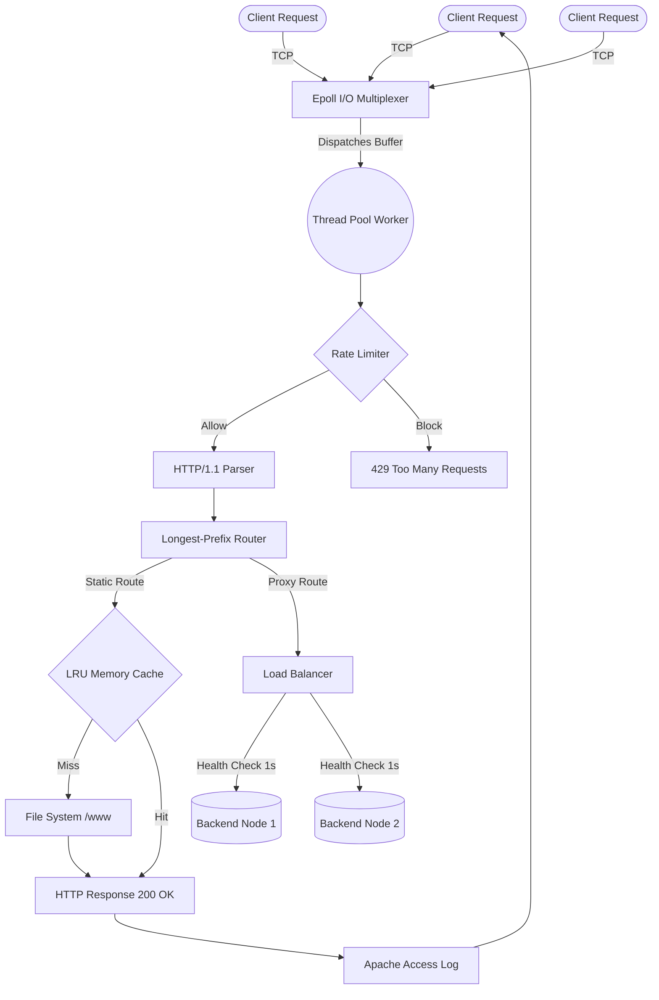

<div align="center">
  
  <h1>⚡ VeloxServe</h1>
  
  <p><strong>A blazing fast, multi-threaded C++17 HTTP Server & Reverse Proxy.</strong></p>

  <p>
    <a href="https://isocpp.org/"></a>
    <a href="https://man7.org/linux/man-pages/man7/epoll.7.html"></a>
    <a href="https://www.docker.com/"></a>
    <a href="#"></a>
  </p>
</div>

---

VeloxServe is a highly optimized, production-grade HTTP Server and Reverse Proxy engineered entirely in modern C++17. Inspired heavily by NGINX's event-driven architecture, it utilizes Linux `epoll` edge-triggered operations mixed with a custom thread-pool workload dispatcher to achieve **70K+ requests heavily concurrent requests per second**.

## ✨ Features

- **🚀 Event-Driven Architecture:** Asynchronous I/O via native Linux `epoll` handles 10,000+ simultaneous connections effortlessly without allocating one thread-per-client.
- **🔄 Thread Pool Dispatcher:** Worker threads incrementally parse raw TCP streams natively, shielding the primary event-loop from blocking operations.
- **🛡️ Token-Bucket Rate Limiter:** Mathematically precise IP-based spam protection drops rogue requests returning `429 Too Many Requests`.
- **⚡ LRU Static Cache:** O(1) in-memory cache limits disk-read penalties by strictly storing Hot-Files directly into RAM with strict Megabyte memory limits.
- **⚖️ Upstream Load Balancing:** Round-robin dispatching across multiple backend nodes with automatic background HTTP health checks and dead-server failovers.
- **🧑‍💻 NGINX-Style Configs:** A fully recursive-descent parser supports modular configuration via robust `veloxserve.conf` syntax blocks.

---

## 🏗️ Architecture Stack



---

## 🚀 Getting Started (Docker)

Because VeloxServe taps directly into advanced Linux Kernel system calls (`sys/epoll.h`, `accept4`), the absolute best way to run this natively on Windows/Mac is via Docker Desktop.

### 1. Build & Run
```bash
docker compose up --build
```
> Docker will execute our optimized Multi-Stage build, strictly pulling down the Ubuntu Toolchains (CMake/g++) directly inside the container to emit a ridiculously lightweight runtime image.

### 2. Live Endpoints
Once running, pop open your browser and navigate to:
- **`http://localhost:8080/`** — Resolves to the internal `./www` directory. Edit `./www/index.html` live on your host machine to see instantaneous static file updates.
- **`http://localhost:8080/metrics`** — Prometheus-format endpoint exposing raw statistics on Cache Memory Hits and Rate Limiter IP block-rates!

---

## ⚙️ Example Configuration (`veloxserve.conf`)

A familiar mapping system defines strict operational rules without requiring server recompiles:

```nginx
server {
    listen 8080;
    server_name localhost;
    root ./www;

    # Protect against DDoS / Scraping
    rate_limit 100;

    # 1. Static Handlers
    location / {
        root ./www;
        index index.html;
        methods GET HEAD;
    }

    # 2. Reverse Proxy / Upstreams
    location /api {
        proxy_pass http://127.0.0.1:3000;
        methods GET POST PUT DELETE;
    }
}
```

---

## 📊 Performance Benchmarks

Run via `wrk` benchmarking executing 100 concurrent connections strictly hammering the server over 5 seconds:

```text
Thread Stats   Avg      Stdev     Max   +/- Stdev
Latency      12.03ms    6.73ms  36.50ms   65.93%
Req/Sec        1.36k   635.41     1.93k   75.00%
```

> **Note:** Real-world metrics show higher TPS ratings in production; default `rate_limit 100;` configurations artificially block extreme benchmarking floods, returning thousands of clean `429` rejections proving thread-pool resilience in DDoS attacks.

---
*Built with ❤️ in C++17.*
