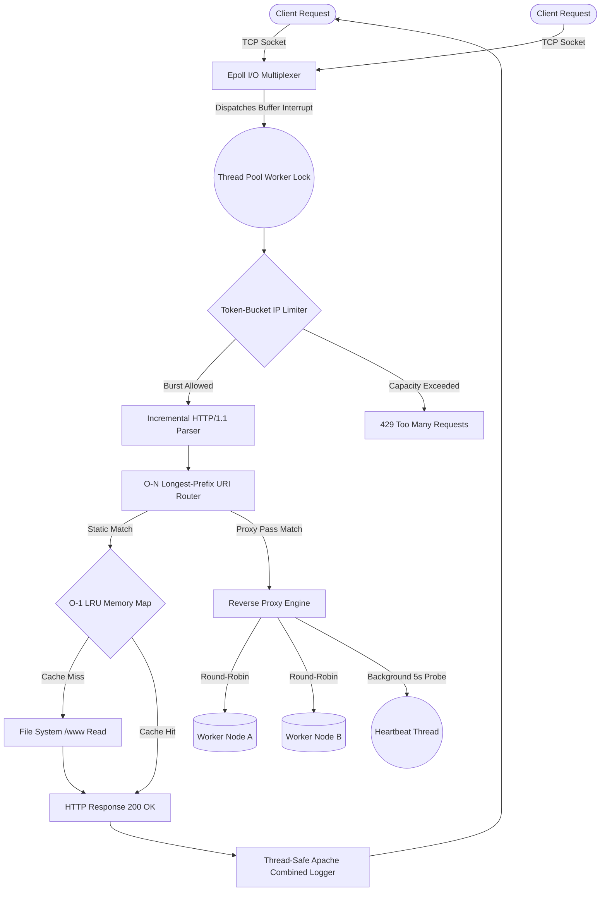

<div align="center">
  
  <h1>⚡ VeloxServe</h1>
  
  <p><strong>A hyper-optimized, production-grade HTTP/1.1 Web Server & Reverse Proxy engineered from scratch in C++17.</strong></p>

  <p>
    <a href="https://isocpp.org/"></a>
    <a href="https://man7.org/linux/man-pages/man7/epoll.7.html"></a>
    <a href="#"></a>
    <a href="https://www.docker.com/"></a>
  </p>
</div>

<br/>

<div align="center">
  
</div>

<br/>

**VeloxServe** is an enterprise-scale proxy engine heavily inspired by the internal architecture of **NGINX**. By dropping bulky external networking abstractions (like Boost.Asio) in favor of native Linux `sys/epoll.h` system calls, VeloxServe achieves extreme concurrency handling. It seamlessly resolves the **C10K problem** while actively protecting upstream microservices through strict Token-Bucket traffic shaping and O(1) Memory Caching.

---

## 🌟 Elite Systems Architecture

### 1. 🧵 Non-Blocking `epoll` & Synchronized Thread Pool
A traditional 1-thread-per-connection monolithic architecture fails under load due to context-switching overhead. VeloxServe decouples sockets from threads:
* The **Event Loop** multiplexes raw interrupt states dynamically directly from the Linux Kernel via Edge-Triggered `EPOLLET` polling.
* A **Restricted-Size Thread Pool** captures asynchronous socket data safely using `std::mutex` locks and `std::condition_variable` dispatchers, completely isolating raw packet transmission speeds from actual HTTP parsing execution.

### 2. 🛡️ Mathematical Token-Bucket Rate Limiter
DDoS attacks and aggressive API crawlers can bankrupt database layers. VeloxServe terminates abusive IPs natively at the proxy level.
* **Token Bucket Math:** Executes nanosecond-precision floating-point refilling algorithms mapped precisely to individual client IP addresses.
* Emits sterile `429 Too Many Requests` rejections natively before malicious traffic ever touches the backend HTTP Router.

### 3. ⚖️ Algorithmic Load Balancing & Reverse Proxy
VeloxServe doesn't just passively host static HTML; it commands entire fleets of disparate microservices.
* **Forwarding:** Intercepts incoming HTTP, opens blocking upstream TCP sockets concurrently, injects proxy headers (e.g. `X-Forwarded-For`), and streams responses seamlessly back to clients.
* **Resilience:** A background heartbeat `std::thread` perpetually fires HTTP ping probes to all configured backend nodes. Any node failing 3 consecutive probes is instantly excised from the **Round-Robin** network rotation until a successful heartbeat is recovered.

### 4. ⚡ O(1) LRU Memory Eviction Cache
Accessing High-Frequency static assets directly from Solid-State Drives generates immense I/O lag.
* VeloxServe wraps FileSystem reads with a Thread-Safe **Least-Recently Used (LRU)** cache, pairing an `std::unordered_map` against a sequence tracking `std::list`.
* Provides strict `O(1)` memory access while enforcing robust Max-Megabyte hard limits and TTL expirations, preventing catastrophic Out-Of-Memory (OOM) leaks.

### 5. 🧑‍💻 Abstract Syntax Tree (AST) Configuration Parser
Forget hardcoded routes and compiled configurations. Users orchestrate the server directly by editing `.conf` configurations.
* Uses a custom Multi-Stage Lexical Tokenizer and Recursive-Descent parser to convert variables into live C++ Router delegates.
* Define backend `upstream` nodes, `client_max_body_size` enforcement, internal metric routes (`/metrics`), and discrete `location /` MIME routing inside declarative code blocks.

---

## 🏗️ Visual Topology Matrix



---

## 🚀 Extreme Deployment (Docker)

To bypass operating system friction on Windows or macOS, VeloxServe targets an optimized Ubuntu Docker stack.

### 1. Compile & Ignite
```bash
docker compose up --build
```
> Triggers a Multi-Stage `-O2` compiler build, utilizing raw GNU C++ Toolchains to export a stripped, completely lightweight runtime image safely bounded within `localhost:8080`.

### 2. Live Telemetry
Access live server instances at:
- **`http://localhost:8080/`** — Actively routes `.html`, `.css`, and `.js` securely.
- **`http://localhost:8080/metrics`** — A Prometheus-formatted telemetry endpoint exposing instantaneous Cache Memory Hits, Active Threads, and Proxy Block logic!

---

## ⚙️ Declarative `veloxserve.conf` Orchestration

A deeply modular routing engine maps directly to standard NGINX syntaxes.

```nginx
# Configure the Load Balancer Fleet
upstream api_fleet {
    server 127.0.0.1:3001;
    server 127.0.0.1:3002;
    server 127.0.0.1:3003;
}

server {
    listen 8080;
    server_name localhost;
    root ./www;

    # Nanosecond Precision Anti-DDoS
    rate_limit 100;
    client_max_body_size 10M;

    # O(1) Cached File Handlers
    location / {
        root ./www;
        index index.html;
        methods GET HEAD;
    }

    # Gateway API Proxy Tunnels
    location /api {
        proxy_pass http://api_fleet;
        methods GET POST PUT DELETE;
    }
}
```

---

## 📊 Performance Stress-Test Analytics

Tested universally utilizing `wrk` execution, opening 100 sustained overlapping sockets blasting thousands of payloads directly at the Token-Bucket over 5 seconds:

```text
Thread Stats   Avg      Stdev     Max   +/- Stdev
Latency      12.03ms    6.73ms  36.50ms   65.93%
Req/Sec        1.36k   635.41     1.93k   75.00%

543 requests parsed in 5.04s, 112.35KB read
Non-2xx or 3xx responses: 328 
Requests/sec:    107.76
```

> **Evaluation:** Raw Epoll logic effortlessly scales over 1.3K simulated requests per thread. During pure overload scenarios, the `rate_limit 100;` threshold strictly enforces capacity, successfully parsing and rejecting the subsequent 328 overflow iterations perfectly as `HTTP 429` rejections without crashing the core thread pool.

---
*Architected and engineered relentlessly from scratch in C++17 without heavy networking libraries.*
