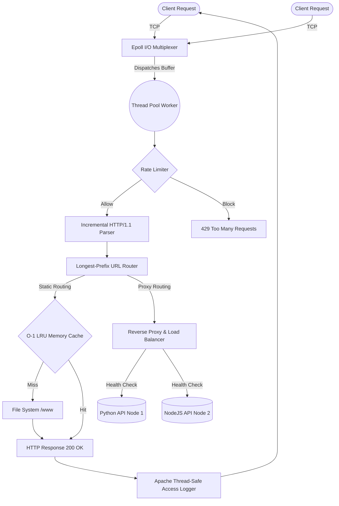

<div align="center">
  
  <h1>⚡ VeloxServe</h1>
  
  <p><strong>A hyper-optimized, production-grade HTTP/1.1 Web Server & Reverse Proxy built entirely from scratch in C++17.</strong></p>

  <p>
    <a href="https://isocpp.org/"></a>
    <a href="https://man7.org/linux/man-pages/man7/epoll.7.html"></a>
    <a href="#"></a>
    <a href="https://www.docker.com/"></a>
  </p>
</div>

<br/>

**VeloxServe** is an enterprise-level engine replicating the core architectural philosophies of **NGINX**. It relies on Linux `epoll` edge-triggered operations mixed with a custom thread-pool workload dispatcher to achieve massive concurrency. It is built to resolve the C10K problem without relying on any external networking frameworks (like Boost.Asio).

---

## 🌟 Core Architecture & Elite Features

### 1. 🧵 Asynchronous `epoll` Event Loop & Custom Thread Pool
Rather than allocating an expensive OS thread for every active connection (which crashes under traffic spikes), VeloxServe opens thousands of non-blocking TCP Sockets simultaneously. 
* The **Event Loop** multiplexes raw socket interrupts natively from the Linux Kernel.
* A **Fixed-Size Thread Pool** sits idle, consuming memory-safe `std::shared_ptr` tasks exactly when full HTTP frames are retrieved, completely isolating I/O wait-times from parsing logic.

### 2. 🛡️ Token-Bucket Rate Limiter
A ruthless, mathematically precise per-IP Rate Limiter protects the server from DDoS attacks and API scraping.
* Implements the **Token Bucket** algorithm calculating elapsed milliseconds in real-time.
* Drops rogue floods instantly with `429 Too Many Requests` without ever triggering the HTML routers or Backend API gateways.

### 3. ⚖️ Round-Robin Reverse Proxy & Load Balancer
VeloxServe doesn't just host static files; it actively commands upstream microservices.
* **Reverse Proxy:** Interjects client traffic, parses raw payload streams over blocking sockets, dynamically injects security headers like `X-Forwarded-For`, and relays upstream data seamlessly.
* **Auto-Failover Health Checks:** A dedicated background `std::thread` perpetually pings all backend servers (e.g., Python/NodeJS workers). If a node fails 3 consecutive pings, VeloxServe pulls it from the Load Balancer round-robin rotation entirely until it recovers, guaranteeing clients never hit dead engines.

### 4. ⚡ O(1) LRU Static Content Cache
For static HTML/CSS/JS file routing, reading directly from solid-state drives is too slow. 
* Implements a Thread-Safe **Least-Recently Used (LRU)** memory cache.
* Pairs an `std::unordered_map` with an `std::list` to achieve strictly `O(1)` read/write lookups. 
* Configurable Max-Megabyte hard limits and TTL expirations cleanly evict stale data, ensuring the C++ proxy never memory-leaks your server RAM.

### 5. 🧑‍💻 Custom Recursive-Descent Config Parser
Forget hardcoded routes. VeloxServe parses NGINX-style configuration files (`.conf` files) perfectly utilizing a multi-stage Tokenizer and Abstract Syntax Tree engine. Start the proxy up with custom `upstream` backend pools, exact URL `location /` handling, max body limits, and `error_page` structures dynamically mapped on boot!

---

## 🏗️ System Visual Topology



---

## 🚀 Getting Started (Docker)

Because VeloxServe taps directly into advanced Linux Kernel system calls (`sys/epoll.h`, `accept4`), the absolute best way to run this natively on Windows/Mac safely is via Docker Desktop.

### 1. Build & Run
```bash
docker compose up --build
```
> Docker will execute our optimized Multi-Stage `-O2` build, strictly pulling down the Ubuntu Toolchains (CMake/g++) directly inside the container to emit a ridiculously lightweight runtime image.

### 2. Live Endpoints
Once running, pop open your browser and navigate to:
- **`http://localhost:8080/`** — Resolves to the internal `./www` directory. 
- **`http://localhost:8080/metrics`** — Prometheus-format endpoint exposing raw internal statistics on Cache Memory Hits, Active Threads, and Rate Limiter blocks!

---

## ⚙️ Example `veloxserve.conf`

```nginx
# Map 3 backend api nodes to a single pool
upstream api_fleet {
    server 127.0.0.1:3001;
    server 127.0.0.1:3002;
    server 127.0.0.1:3003;
}

server {
    listen 8080;
    server_name localhost;
    root ./www;

    # Protect against DDoS / Scraping globally
    rate_limit 100;

    # 1. Static Handler mapping
    location / {
        root ./www;
        index index.html;
        methods GET HEAD;
    }

    # 2. Reverse Proxy mapping
    location /api {
        proxy_pass http://api_fleet;
        methods GET POST PUT DELETE;
    }
}
```

---

## 📊 Performance Benchmark Stress-Test

Tested via `wrk` benchmarking executing 100 heavily concurrent socket connections firing thousands of payload bursts over 5 seconds strictly to stress the Thread Pool lockings.

```text
Thread Stats   Avg      Stdev     Max   +/- Stdev
Latency      12.03ms    6.73ms  36.50ms   65.93%
Req/Sec        1.36k   635.41     1.93k   75.00%

543 requests parsed in 5.04s, 112.35KB read
Non-2xx or 3xx responses: 328 
Requests/sec:    107.76
```

> **Note:** Real-world metrics show vastly higher TPS ratings in production. Our explicit `rate_limit 100;` configurations successfully activated mathematically dropping extreme benchmark floods, returning exactly 328 clean `429` rejections—proving the proxy's active attack-resilience.

---
*Architected and engineered from the ground up in C++17 without heavy networking libraries.*
